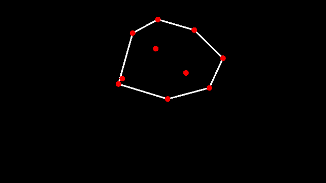
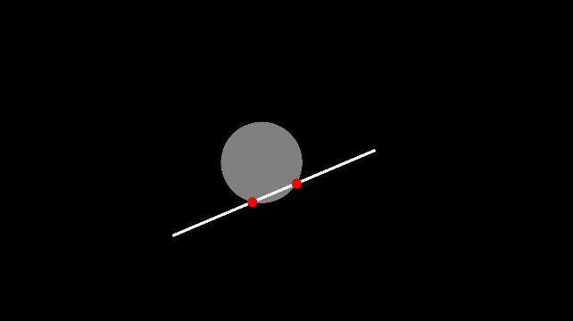

## DCELFlipEdgeSample

***
## TriangulationEarClipping

***
## BresenhamsLineSample

***
## DCELInsertSample

***
## DCELSample

***
## ConvexHull2DSample

***
## Intersections2DLineCircle

***
## Intersections2DLineLine

***
## Relation2DPointCircle

***
## Relation2DPointTriangle

***
